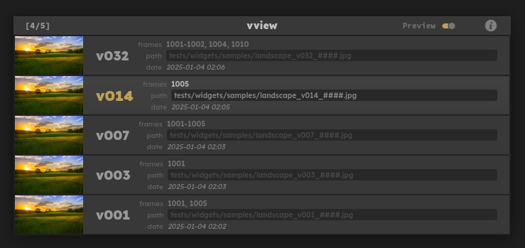

# vview

Pop-up for Foundry's Nuke to change the version of selected nodes



## ✨ Features

- Simple pop-up heavily inspired by Hiero
- Live preview
- Support for relative path
- Node frame-range
- Tumbnails

## ⚡️ Requirements

- Nuke 13.0+

## 📦 Installation

### Download
Download the zip file of this project and unpack it somewhere. ex: `C:\Users\my_user\.nuke\vview`
> The downloaded zip file can be deleted once unpacked.

**or**

Use one of the commands:
```shell
# Linux / Macos
git clone https://github.com/mapoga/vview ~/.nuke/vview

# Windows PowerShell
git clone https://github.com/mapoga/vview ~\.nuke\vview

# Windows Command Prompt
git clone https://github.com/mapoga/vview %USERPROFILE%\.nuke\vview
```

### ⚙️ Configure
Add this line somewhere in your `init.py` file. 
```python
nuke.pluginAddPath(r"C:\Users\my_user\.nuke\vview\src")
```
> Adjust the path to your own install. Take note that the path is pointing inside `vview\src`.

Add this snippet somewhere in your `menu.py` file. Feel free to change the shortcut to your liking.
```python
import vview
nuke.menu('Nuke').findItem('Edit/Node/Filename').addCommand("vview", vview.launch, shortcut="Ctrl+Up")
```

Optionally, the command can be customized. Here are the default values.

- `thumb_enabled`:  Show/Hide the thumbnails.
- `thumb_reformat`: `"FIT"`, `"FILL"`, `"DISTORT"`, `"EXPANDING"`.
- `change_range`:   Update the frame-range of the Read nodes.

```python
import vview
nuke.menu('Nuke').findItem('Edit/Node/Filename').addCommand(
    "vview",
    lambda vview.launch(
        thumb_enabled=True,
        thumb_reformat="FILL",
        change_range=True
    ),
    shortcut="Ctrl+Up",
)
```

> If the `.nuke/init.py` and `.nuke/menu.py` files did not already exist you need to create them.

## 🚀 Usage
1. Select **Read** node(s).
2. Press the shortcut keys `Ctrl + Up` and **vview** will appear.
3. If you have multiple **Read** nodes selected, the first one with a valid path will be displayed.
4. Change version using the **arrow keys**. If preview mode is active, the nodes will be updated interactively.
5. Press `Enter` to apply the change. The version change will apply to all selected nodes. Each node will have its frame-range scanned/updated individually. 
6. Alternatively, press `Escape` to cancel.

## ⌨️ Mappings
| Action | keymap |
| --- | --- |
| Max version | `Ctrl+Up`, `Ctrl+Right` |
| Next version | `Up`, `Right` |
| Prev version | `Down`, `Left` |
| Min version | `Ctrl+Down`, `Ctrl+Left` |
| Confirm | `Enter` |
| Cancel | `Escape` |
| Open folder | `Ctrl+O` |
