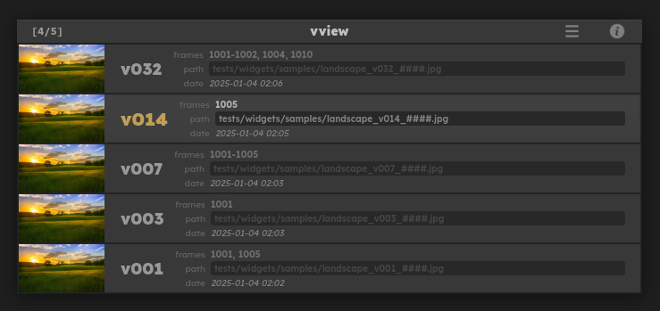

# vview

Dialog for Foundry's Nuke to change the version of selected nodes



## ✨ Features

- Simple dialog heavily inspired by Hiero
- Live preview
- Support for relative path
- Node frame-range
- Thumbnails

## ⚡️ Requirements

- Nuke 13.0+

## 📦 Installation

### Download
Download the zip file of this project and unpack it somewhere. ex: `C:\Users\my_user\.nuke\mapoga\vview`

> [!IMPORTANT]
> This package cannot be placed directly inside `.nuke`.
> It must be placed in a folder that is not part of nuke's plugin path.
> Here the `mapoga` folder is used to shield `vview` from being directly imported.

**or**

Use one of the commands:
```shell
# Linux / Macos
git clone https://github.com/mapoga/vview ~/.nuke/mapoga/vview

# Windows PowerShell
git clone https://github.com/mapoga/vview ~\.nuke\mapoga\vview

# Windows Command Prompt
git clone https://github.com/mapoga/vview %USERPROFILE%\.nuke\mapoga\vview
```


### Configure

Add this line somewhere in your `init.py` file.
```python
nuke.pluginAddPath(r"mapoga\vview\src")
```

> [!IMPORTANT]
> Adjust the path to your own install. Take note that the path is pointing inside `vview\src`.

Add this snippet somewhere in your `menu.py` file. Feel free to change the shortcut to your liking.
```python
import vview
nuke.menu('Nuke').findItem('Edit/Node/Filename').addCommand("vview", vview.launch, shortcut="Ctrl+Up")
```

> [!TIP]
> If the `.nuke/init.py` and `.nuke/menu.py` files did not already exist you need to create them.


## 🚀 Usage
1. Select **Read** node(s).
2. Press the shortcut keys `Ctrl + Up` and **vview** will appear.
3. If you have multiple **Read** nodes selected, the first one with a valid path will be displayed.
4. Change version using the **arrow keys**. If preview mode is active, the nodes will be updated interactively.
5. Press `Enter` to apply the change. The version change will apply to all selected nodes. Each node will have its frame-range scanned/updated individually.
6. Alternatively, press `Escape` to cancel.

## ⌨️ Mappings
| Action | keymap |
| --- | --- |
| Max version | `Ctrl+Up`, `Ctrl+Right` |
| Next version | `Up`, `Right` |
| Prev version | `Down`, `Left` |
| Min version | `Ctrl+Down`, `Ctrl+Left` |
| Confirm | `Enter` |
| Cancel | `Escape` |
| Open folder | `Ctrl+O` |

## ⚙️ Options
### Display node
The displayed node will be the **first** node with a **non-empty** `file` knob value.

The selected nodes can be sorted to influence their display priority using the `node_sort_key_fct` argument. By default, the nodes are in their selected order.

In this example, nodes with the word "\_main\_" in their filename have higher priority while nodes with "crypto" in their filename have lower priority. Their original selection index is used as a secondary sort key and their nesting depth is not used.

```python
import re
import nuke
import vview

def node_sort_key_fct(node, idx, depth):
    knob = node.knob("file")
    if isinstance(knob, nuke.File_Knob):
        path = knob.value()
        if path:
            if re.search(r"_main_", path):
                return 0, idx
            elif re.search(r"crypto", path):
                return 2, idx
            return 1, idx
    return 3, idx

nuke.menu("Nuke").findItem("Edit/Node/Filename").addCommand(
    "vview",
    lambda: vview.launch(node_sort_key_fct=node_sort_key_fct),
    shortcut="Ctrl+Up",
)

```
